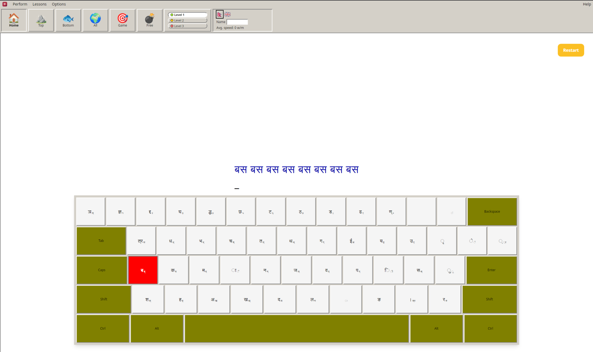

# Typeshala (working title)

[](https://github.com/Abhishek-Gaire/typeshala/releases)
[](./LICENSE)
[](https://github.com/Abhishek-Gaire/typeshala/releases)

An open-source, cross-platform typing tutor for English and Nepali (Traditional/Preeti and Romanized Unicode), built with Tauri v2, React, and Vite. Runs natively on Windows, macOS, and Linux.

A bilingual (English / Nepali) typing tutor desktop app. Practice English typing, Nepali romanized typing, and the traditional Preeti layout, with structured lessons, progress stats, themes, and a bonus Ramayana game.



## Why this exists

The classic Windows-era Nepali typing tutor "Typshala" (also seen as "Typeshala") was a well-loved tool for learning Nepali typing, but it's a 16-bit application that no longer runs natively on modern 64-bit Windows without an emulator or compatibility layer. This project recreates its layout, drill structure, and interaction design from scratch as a modern, actively runnable, cross-platform app — so the same learning experience doesn't require jumping through hoops to use today.

## Source of truth

GitLab is the source of truth: [abhishek_gaire/typeshala on GitLab](https://gitlab.com/abhishek_gaire/typeshala).

The GitHub repository is a read-only mirror — it only hosts release assets (CI builds for Windows, macOS, and Linux). Please do all contributing, issues, and merge requests on GitLab, not GitHub.

## Download

Installers for v1.0.1, built by CI. No account, no subscription, works offline.

| Platform              | File                                                                                                                    | Notes                               |
| --------------------- | ----------------------------------------------------------------------------------------------------------------------- | ----------------------------------- |
| Windows               | [`x64-setup.exe`](https://github.com/Abhishek-Gaire/typeshala/releases/download/v1.0.1/Typeshala_1.0.1_x64-setup.exe)   | Recommended. Runs the setup wizard. |
| Windows               | [`x64_en-US.msi`](https://github.com/Abhishek-Gaire/typeshala/releases/download/v1.0.1/Typeshala_1.0.1_x64_en-US.msi)   | For managed or scripted installs.   |
| macOS (Apple Silicon) | [`aarch64.dmg`](https://github.com/Abhishek-Gaire/typeshala/releases/download/v1.0.1/Typeshala_1.0.1_aarch64.dmg)       | M1/M2/M3.                           |
| macOS (Intel)         | [`x64.dmg`](https://github.com/Abhishek-Gaire/typeshala/releases/download/v1.0.1/Typeshala_1.0.1_x64.dmg)               |                                     |
| Linux                 | [`amd64.AppImage`](https://github.com/Abhishek-Gaire/typeshala/releases/download/v1.0.1/Typeshala_1.0.1_amd64.AppImage) | Portable, runs on any distro.       |
| Linux                 | [`amd64.deb`](https://github.com/Abhishek-Gaire/typeshala/releases/download/v1.0.1/Typeshala_1.0.1_amd64.deb)           | Debian, Ubuntu, Mint.               |
| Linux                 | [`x86_64.rpm`](https://github.com/Abhishek-Gaire/typeshala/releases/download/v1.0.1/Typeshala-1.0.1-1.x86_64.rpm)       | Fedora, RHEL, openSUSE.             |

All releases: [github.com/Abhishek-Gaire/typeshala/releases](https://github.com/Abhishek-Gaire/typeshala/releases) · project page: [typeshala.abhishekgaire.com.np](https://typeshala.abhishekgaire.com.np)

<details>
<summary>Install notes</summary>

**macOS** — the builds are not yet notarized, so Gatekeeper quarantines the download. Either allow it once in System Settings → Privacy & Security, or clear the quarantine flag:

```bash
xattr -cr /Applications/Typeshala.app
```

**Linux AppImage** — make it executable first:

```bash
chmod +x Typeshala_1.0.1_amd64.AppImage && ./Typeshala_1.0.1_amd64.AppImage
```

**Linux .deb / .rpm**:

```bash
sudo dpkg -i Typeshala_1.0.1_amd64.deb && sudo apt-get install -f
sudo dnf install Typeshala-1.0.1-1.x86_64.rpm
```

**Android** — a touch-board build exists but no APK is published yet.

</details>

Update the version and filenames above on each release, alongside the version bump in `package.json`, `src-tauri/tauri.conf.json`, and `src-tauri/Cargo.toml`.

## Features

- English typing tutor with structured lessons and progression
- Nepali romanized and traditional Preeti layouts
- Classic practice screens with drills
- Progress trends and stats
- Bilingual UI (English / Nepali) with themes and settings
- Local-first: progress stored on-device via the Tauri store plugin

## Building from source

To work on Typeshala itself rather than install it.

### Requirements

- Node 20+
- Rust stable toolchain
- npm

### Getting started

```bash
npm install
npm run tauri dev
```

## Build

```bash
npm run build
npm run tauri build
```

## Test

```bash
npm test
npm run typecheck
```

## Lint and format

```bash
npm run lint
npm run format:check
```

## Project layout

- `src/domain/` — typing rules, WPM/accuracy math (no framework imports)
- `src/application/` — thin use cases over domain logic and storage ports
- `src/infrastructure/` — store and Tauri bridge wrappers
- `src/features/` — feature-grouped React views
- `src/components/` — shared UI parts
- `src/i18n/` — English and Nepali strings with typed keys
- `src/styles/` — design tokens and themes
- `tests/` — vitest suites mirroring `src/` structure
- `docs/specs/` — build specs per slice
- `docs/design/` — visual guides per screen

See `AGENTS.md` for the full contributor conventions and `CONTRIBUTING.md` for the contribution workflow.

## Project docs

- [`typeshala-architecture-plan.md`](./typeshala-architecture-plan.md) — overall architecture, tech stack, build phases
- [`src/domain/preeti.ts`](./src/domain/preeti.ts) — the Traditional/Preeti key-mapping engine

## Acknowledgements

This project is inspired by the layout, feature set, and interaction design of the classic Windows-era Nepali typing tutor known as **Typshala / Typeshala**, and its later 64-bit-compatible rebrand, **TypeSolute**.

**All code in this repository is written from scratch.** No original code, binaries, fonts, or artwork from Typshala/Typeshala/TypeSolute are included or reproduced here. This project independently recreates the general layout, color-coding conventions, and drill structure observed in that software's interface — functional design patterns rather than copyrighted creative expression — as its own implementation, and claims no ownership over, and asserts no rights to, the original software, its name, or its assets.

We made a genuine effort to identify and credit the original software's developer by name, but were unable to confirm one from public sources at the time of writing. Some secondary sources attribute early versions to entities such as "Softkey Computers" or "YOURS IT SOLUTION," and the later TypeSolute rebrand is credited to AppSolute Innovation — but none of this could be independently verified against an authoritative source, so no specific name is credited here to avoid misattribution.

**If you are the original developer, a rights holder, or can confirm the correct attribution, please open an issue on this repository** — this section will be updated with a specific credit as soon as it can be confirmed.

The Preeti reference charts in `public/preeti1.png`, `public/preeti2.png`, and
`public/preeti3.png` are screenshots taken from third-party websites. This
project does not own them. They are included for reference only, to document
the Preeti keymap; all rights remain with their original authors. The
`reference/preeti-keymap.ts` transcription is provided on the same basis, for
reference only.

## License

MIT — see [LICENSE](LICENSE).
